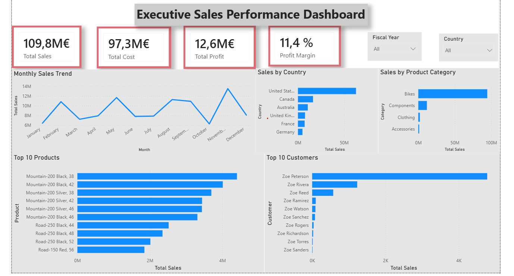

# 📊 Executive Sales Performance Dashboard



---

## 📌 Project Overview

This project showcases an interactive **Executive Sales Performance Dashboard** built using **Microsoft Power BI** and the **AdventureWorks Sales Dataset**.

The dashboard provides executives and business managers with a comprehensive view of business performance through interactive visualizations, KPIs, and dynamic filtering.

---

## 🎯 Project Objectives

- Monitor Total Sales
- Track Total Cost
- Analyze Total Profit
- Measure Profit Margin
- Analyze Monthly Sales Performance
- Compare Sales Across Countries
- Evaluate Product Categories
- Identify Top Products
- Identify Top Customers

---

## 📈 Key Performance Indicators (KPIs)

| KPI | Value |
|-----|-------|
| Total Sales | €109.8M |
| Total Cost | €97.3M |
| Total Profit | €12.6M |
| Profit Margin | 11.4% |

---

## 📊 Dashboard Features

- Executive KPI Cards
- Monthly Sales Trend Analysis
- Sales by Country
- Sales by Product Category
- Top 10 Products
- Top 10 Customers
- Fiscal Year Filter
- Country Filter

---

## 🛠 Tools & Technologies

- Microsoft Power BI Desktop
- DAX (Data Analysis Expressions)
- Power Query
- Data Modeling
- Interactive Visualizations

---

## 📂 Project Structure

```text
Executive-PowerBI-Dashboard/
│
├── README.md
├── Dashboard/
├── Dataset/
├── Documentation/
└── Images/
```

---

## 📸 Dashboard Preview

The complete dashboard screenshot is available in the **Images** folder.

---

## 📄 Documentation

Additional documentation is available in:

- Documentation/DAX_Measures.md
- Documentation/Business_Insights.md

---

## 📌 Dataset

AdventureWorks Sales Dataset

---

## 🚀 Skills Demonstrated

- Data Modeling
- DAX Calculations
- KPI Development
- Dashboard Design
- Data Visualization
- Business Intelligence
- Executive Reporting
- Interactive Slicers
- Performance Analysis

---

## 👨‍💻 Author

**Gnana Deepika Gutha**

Aspiring Data Analyst | Power BI | SQL | Python | Data Science
